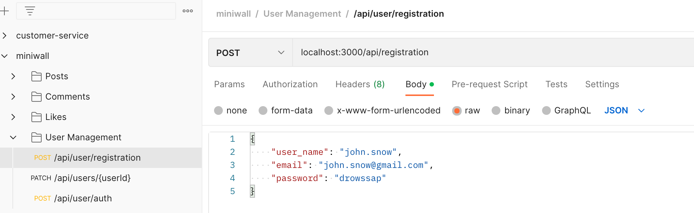
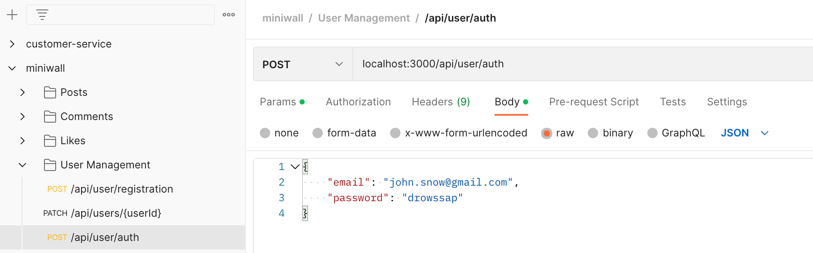
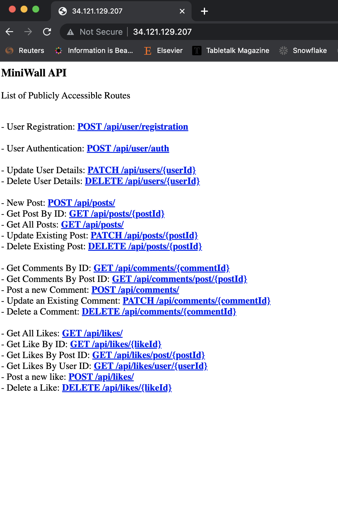

# MiniWall API Platform
## C4 Diagram Overview


## Project Code Structure


## Requirement

- NodeJS Environment
- MongoDB Docker instance
- Docker


## Usage

### Clone this repository:

```
$ git clone git@github.com:temi-f/miniwall.git
```

### Install Dependencies
#### Core Packages `express mongoose nodemon dotenv`
```shell
npm install express mongoose nodemon body-parser dotenv
```

#### Validation Package `JOI`
```shell
npm install joi
```

#### Encryption/Decryption Package `bcryptjs`
```shell
npm install bcryptjs
```

#### Token Management Package `JSONWebToken (JWT)`
```shell
npm install jsonwebtoken
```


### Build the app into a Docker Impage
```
$ docker image  build -t miniwall-app-image:1 .
```

### Run the image as a container
```
$ docker container run -d --name miniwall-app --publish 80:3000 miniwall-app-image:1
```

### Open up a postman and access the endpoints at:
```
`http://localhost:80/`
```

### Install the MiniWall Postman collection:
The MiniWall API can be tested manually and interacted with using this . 

### Interacting with the MiniWall API
In order to interact with the MiniWall API, a user must meet the following prerequisite:
1. Have a registered account
2. Have an authication token which must be used with each API request 

#### Registering a user account
- A user account can be registered by making a POST request to the following endpoint:
```
`http://localhost:80/api/user/registration`
```
- The Payload must be a JSON payload containing `user_name`, `email` and `password`. For example:
    ```
    {
        "user_name": "john.snow",
        "email": "john.snow@gmail.com",
        "password": "drowssap"
    }
    ```
    See screenshot below:
    


#### Obtaining an Authentication Token
- A registered User can obtain an authentication token by making a POST request to the following endpoint:
```
`http://localhost:80/api/user/auth`
```
- The Payload must be a JSON payload containing `email` and `password`. For example:
    ```
    {
        "email": "john.snow@gmail.com",
        "password": "drowssap"
    }
    ```
    


#### Making an API Resource Request
- Once an `authentication token` has been obtained (see above step), requests to the MiniWall API must include the `Token` in order to make a successful API request.

- The `authentication token` must be copied and added to the HTTP client Headers as a parameter named as `auth-token`.
  The `auth-token` value must be contructed in the format below:
    ```
    `Bearer <TOKEN_VALUE_OBTAINED_FROM_USER_AUTHENTICATION_STEP_ABOVE>`
    ```
  See screenshot below:
  


#### API Request Format
The List of API requests available can found in the .
Generally, the format is as below:
```
`http://localhost:80/{API_RESOURCE_ROUTE}`
```
See screenshot below for resource routes:

