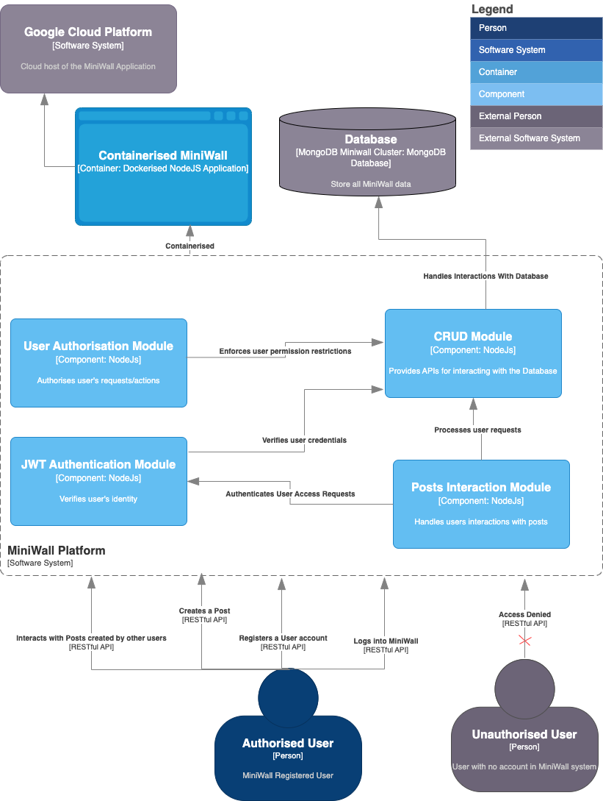
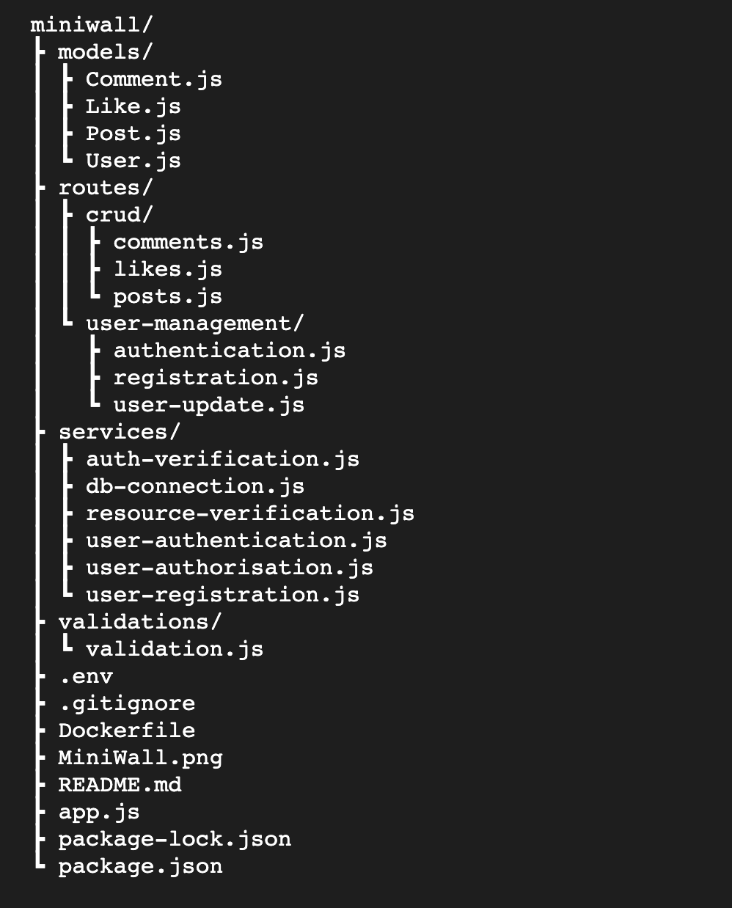

# MiniWall API Platform
## C4 Diagram Overview


## Project Code Structure


## Requirement

- NodeJS Environment
- MongoDB Docker instance
- Docker


## Usage

### Clone this repository:

```
$ git clone git@github.com:temi-f/miniwall.git
```

### Install Dependencies
#### Core Packages `express mongoose nodemon dotenv`
```shell
npm install express mongoose nodemon body-parser dotenv
```

#### Validation Package `JOI`
```shell
npm install joi
```

#### Encryption/Decryption Package `bcryptjs`
```shell
npm install bcryptjs
```

#### Token Management Package `JSONWebToken (JWT)`
```shell
npm install jsonwebtoken
```


### Build the app into a Docker Impage
```
$ docker image  build -t miniwall-app-image:1 .
```

### Run the image as a container
```
$ docker container run -d --name miniwall-app --publish 80:3000 miniwall-app-image:1
```

### Open up a browser/postman and access the endpoints
```
`http://localhost:80`
```